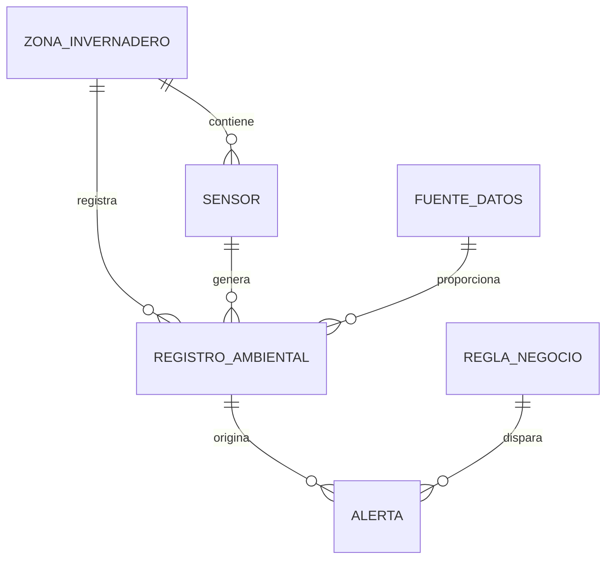
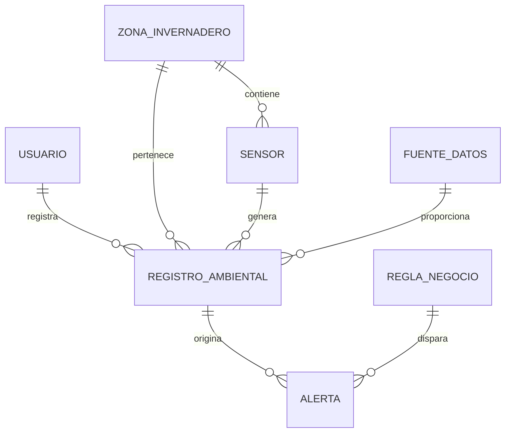

# GreenMonitor Local — Sistema local de monitoreo ambiental y generación de alertas para invernaderos

## Descripción general del proyecto

**GreenMonitor Local** es un sistema de información local diseñado para el monitoreo ambiental de un invernadero. El proyecto permite registrar, consultar, analizar y visualizar información ambiental interna y externa, como temperatura, humedad relativa, humedad del suelo, radiación solar, índice UV, zona del invernadero, estado de ventilación, fecha y hora de medición.

El sistema también genera alertas automáticas a partir de reglas de negocio previamente definidas, por ejemplo:

* Temperatura interior excesiva.
* Temperatura exterior crítica.
* Humedad relativa insuficiente.
* Humedad del suelo baja.
* Índice UV alto.
* Radiación solar alta.
* Estrés hídrico.
* Necesidad de ventilación.

El proyecto está organizado por fases para cumplir con los principios de **análisis estructurado de sistemas**, incluyendo diagramas, diccionario de datos, modelo entidad-relación, base de datos, interfaz web local, documentación técnica y evidencia de implementación.

---

## Objetivo general

Diseñar, modelar e implementar un sistema local para administrar registros ambientales de un invernadero, permitiendo la consulta de información histórica, análisis de condiciones ambientales, generación de alertas automáticas y visualización de estadísticas básicas mediante una interfaz web local.

---

## Objetivos específicos

* Aplicar análisis estructurado mediante diagramas de contexto, DFD Nivel 0 y DFD Nivel 1.
* Diseñar el modelo Entidad-Relación del sistema.
* Crear una base de datos relacional en MySQL.
* Documentar el diccionario de datos.
* Implementar una aplicación web local funcional.
* Permitir carga y consulta de registros ambientales.
* Visualizar alertas activas generadas automáticamente.
* Filtrar registros por fecha, zona y tipo de zona.
* Calcular estadísticas básicas por hora y por día.
* Documentar el desarrollo mediante fases, metodología Scrum y referencias.

---

## Tecnologías utilizadas

| Tecnología          | Uso dentro del proyecto                                  |
| ------------------- | -------------------------------------------------------- |
| Python              | Desarrollo de la aplicación web local                    |
| SQLite              | Base de datos local ejecutable para pruebas rápidas      |
| MySQL               | Base de datos formal para entrega académica              |
| HTML/CSS/JavaScript | Interfaz web local                                       |
| Mermaid             | Código editable de diagramas                             |
| Graphviz DOT        | Código alternativo editable para diagramas               |
| Scrum               | Organización del desarrollo por fases, backlog y sprints |
| SSH                 | Forma propuesta de conexión dentro de la red local       |

---

## Cómo ejecutar el proyecto

### Requisito principal

Tener instalado **Python 3.10 o superior**.

### Ejecución local

Desde la raíz del proyecto ejecutar:

```bash
python run.py
```

Después abrir el navegador en:

```text
http://localhost:8000
```

El sistema se levanta en modo local y permite consultar registros, visualizar alertas, filtrar información y revisar estadísticas.

---

## Funcionamiento general del sistema

Cuando se ejecuta el archivo `run.py`, el sistema realiza las siguientes acciones:

1. Inicia el servidor web local.
2. Crea la base de datos SQLite si todavía no existe.
3. Crea las tablas necesarias.
4. Inserta datos iniciales de prueba.
5. Evalúa las reglas de negocio.
6. Genera alertas automáticas si encuentra condiciones críticas.
7. Muestra la interfaz web local para consulta y administración.

Código principal de arranque:

```python
from src.greenmonitor.app import run_server

if __name__ == "__main__":
    run_server(host="0.0.0.0", port=8000)
```

El uso de `host="0.0.0.0"` permite que el sistema pueda ser consultado desde otros equipos dentro de la misma red local, siempre que el firewall y la red lo permitan.

---

# Estructura general del repositorio

```text
greenmonitor_local_invernadero/
├── README.md
├── GITHUB_SETUP.md
├── LICENSE
├── .gitignore
├── run.py
├── MANIFESTO_ARCHIVOS.md
├── data/
├── docs/
├── diagrams/
├── database/
├── src/
├── scripts/
└── tests/
```

---

# Explicación de cada archivo y carpeta

## Archivos principales de la raíz

### `README.md`

Archivo principal del repositorio. Explica el objetivo del proyecto, alcance, tecnologías utilizadas, instrucciones de ejecución, estructura general y funcionamiento del sistema.

Este archivo funciona como la primera guía de lectura para cualquier persona que abra el repositorio.

---

### `GITHUB_SETUP.md`

Documento con instrucciones para crear el repositorio en GitHub y subir los archivos del proyecto.

Incluye comandos básicos como:

```bash
git init
git add .
git commit -m "Proyecto GreenMonitor Local"
git branch -M main
git remote add origin https://github.com/USUARIO/NOMBRE_REPOSITORIO.git
git push -u origin main
```

Este archivo sirve para documentar el proceso de publicación del proyecto en GitHub.

---

### `LICENSE`

Archivo de licencia del proyecto. Indica las condiciones bajo las cuales el código y la documentación pueden ser usados o compartidos.

---

### `.gitignore`

Archivo que indica qué archivos no deben subirse a GitHub, por ejemplo archivos temporales, carpetas de entorno virtual y bases de datos generadas localmente.

Ejemplo de contenido:

```gitignore
__pycache__/
*.py[cod]
.env
.venv/
venv/
data/*.db
data/*.sqlite
.vscode/
.idea/
*.log
```

Esto ayuda a mantener limpio el repositorio y evita subir archivos innecesarios.

---

### `run.py`

Archivo principal para ejecutar la aplicación web local.

Su función es importar el servidor desde el módulo principal de la aplicación y ponerlo en ejecución.

```python
from src.greenmonitor.app import run_server

if __name__ == "__main__":
    run_server(host="0.0.0.0", port=8000)
```

Este archivo es importante porque permite ejecutar todo el sistema de forma sencilla con un solo comando:

```bash
python run.py
```

---

### `MANIFESTO_ARCHIVOS.md`

Documento resumen que explica qué contiene cada carpeta principal del proyecto.

Sirve como una guía rápida para ubicar los archivos del repositorio.

---

# Carpeta `docs/`

La carpeta `docs/` contiene toda la documentación formal del proyecto, organizada por fases.

```text
docs/
├── 00_portada_resumen/
├── 01_fase_scrum/
├── 02_fase_analisis_estructurado/
├── 03_fase_modelado_bd/
├── 04_fase_implementacion_bd/
├── 05_fase_app_web_local/
├── 06_fase_pruebas_evidencias/
├── 07_fase_despliegue_ssh_red_local/
├── 08_referencias/
└── INDICE_DOCUMENTACION.md
```

---

## `docs/INDICE_DOCUMENTACION.md`

Índice general de la documentación. Permite saber qué archivo abrir según la fase del proyecto que se quiera revisar.

---

## `docs/00_portada_resumen/`

Contiene los documentos iniciales del proyecto.

### `00_portada.md`

Portada académica del proyecto. Incluye título, descripción del sistema y datos generales para presentación.

### `01_resumen_ejecutivo.md`

Resumen general del proyecto. Explica de manera breve qué problema resuelve el sistema, qué incluye y cuál es su importancia.

---

## `docs/01_fase_scrum/`

Documenta la metodología ágil utilizada.

### `README_Fase_01_Scrum.md`

Explica cómo se aplicó Scrum en el desarrollo del proyecto.

### `product_backlog.md`

Contiene el backlog del producto, es decir, la lista de funcionalidades requeridas para el sistema.

Ejemplos de historias de usuario:

```text
Como usuario administrador, quiero registrar condiciones ambientales para mantener actualizada la base de datos del invernadero.

Como encargado del invernadero, quiero consultar alertas activas para tomar decisiones rápidas ante condiciones críticas.
```

### `sprints.md`

Describe la organización del trabajo en sprints, indicando qué actividades se realizaron en cada etapa.

---

## `docs/02_fase_analisis_estructurado/`

Contiene la documentación del análisis estructurado del sistema.

### `README_Fase_02_Analisis_Estructurado.md`

Explica qué es el análisis estructurado aplicado al proyecto y cómo se relacionan los procesos, entidades, almacenes de datos y flujos de información.

### `diagrama_contexto_explicacion.md`

Explica el Diagrama de Contexto.

Este modelo muestra el sistema como un solo proceso central y su relación con entidades externas como:

* Usuario administrador.
* Sensores ambientales.
* Fuente meteorológica externa.
* Encargado del invernadero.

### `dfd_nivel_0_explicacion.md`

Explica el DFD Nivel 0.

Este diagrama divide el sistema en procesos principales:

1. Capturar registros ambientales.
2. Consultar información histórica.
3. Evaluar reglas de negocio.
4. Generar alertas.
5. Mostrar estadísticas.

### `dfd_nivel_1_explicacion.md`

Explica el DFD Nivel 1.

Este diagrama detalla con mayor profundidad el proceso de evaluación de reglas y generación de alertas.

---

## `docs/03_fase_modelado_bd/`

Contiene la documentación del modelo de datos.

### `README_Fase_03_Modelado_BD.md`

Explica el proceso de diseño de la base de datos y cómo se identificaron las entidades principales.

### `modelo_er_explicacion.md`

Explica el Modelo Entidad-Relación.

El modelo ER representa entidades como:

* Usuario.
* Zona del invernadero.
* Sensor.
* Fuente de datos.
* Registro ambiental.
* Regla de negocio.
* Alerta.

### `normalizacion.md`

Documento que explica cómo se aplicó la normalización de la base de datos para evitar duplicidad de información.

Por ejemplo, las zonas, sensores y fuentes de datos se separan en tablas distintas para no repetir nombres o descripciones dentro de cada registro ambiental.

### `diccionario_datos.md`

Diccionario de datos en formato Markdown.

Describe cada tabla, campo, tipo de dato, llave primaria, llave foránea y propósito dentro del sistema.

---

## `docs/04_fase_implementacion_bd/`

Contiene la documentación sobre la construcción de la base de datos.

### `README_Fase_04_Implementacion_BD.md`

Explica cómo se implementó la base de datos en MySQL y SQLite.

### `origen_y_obtencion_datos.md`

Explica de dónde provienen los datos ambientales.

El proyecto considera dos tipos de datos:

1. Datos internos simulados de sensores.
2. Datos externos de referencia compatibles con fuentes meteorológicas como NASA POWER.

### `reglas_negocio.md`

Documento donde se explican las reglas de negocio usadas para generar alertas automáticas.

Ejemplo:

```text
Si la temperatura interior es mayor a 32 °C, se genera una alerta de temperatura interior excesiva.
```

---

## `docs/05_fase_app_web_local/`

Contiene la explicación de la interfaz web local.

### `README_Fase_05_App_Web_Local.md`

Explica cómo funciona la interfaz web, qué pantallas incluye y qué operaciones puede realizar el usuario.

La interfaz permite:

* Consultar registros ambientales.
* Ver alertas activas.
* Filtrar por fecha o zona.
* Revisar estadísticas básicas.
* Agregar nuevos registros ambientales.

---

## `docs/06_fase_pruebas_evidencias/`

Contiene evidencia de validación del sistema.

### `README_Fase_06_Pruebas_Evidencias.md`

Explica qué pruebas se realizaron para comprobar que el sistema funciona.

### `reporte_validacion_local.md`

Documento donde se describe la validación de ejecución local del sistema.

---

## `docs/07_fase_despliegue_ssh_red_local/`

Contiene la explicación del despliegue local.

### `README_Fase_07_Despliegue_SSH.md`

Explica cómo se puede ejecutar el sistema en una computadora servidor dentro de una red local y cómo otros equipos pueden conectarse.

También documenta el uso de SSH para administración remota.

Ejemplo de conexión:

```bash
ssh usuario@IP_DEL_SERVIDOR
```

---

## `docs/08_referencias/`

Contiene las fuentes consultadas.

### `referencias.md`

Documento con referencias usadas para justificar el diseño del sistema, la metodología Scrum, el uso de bases de datos relacionales y la estructura de datos ambientales.

---

# Carpeta `diagrams/`

La carpeta `diagrams/` contiene todos los diagramas obligatorios del proyecto.

```text
diagrams/
├── README.md
├── codigo_mermaid/
├── codigo_dot/
└── imagenes_png/
```

---

## `diagrams/README.md`

Explica cómo están organizados los diagramas y cómo se pueden visualizar o editar.

---

## `diagrams/codigo_mermaid/`

Contiene los diagramas en código Mermaid. Estos archivos son editables y se pueden pegar en editores compatibles con Mermaid.

### `01_diagrama_contexto.mmd`

Código del Diagrama de Contexto.

Representa al sistema como un proceso central conectado con usuarios, sensores y fuentes externas.

### `02_dfd_nivel_0.mmd`

Código del DFD Nivel 0.

Representa los procesos principales del sistema y los almacenes de datos.

### `03_dfd_nivel_1.mmd`

Código del DFD Nivel 1.

Detalla el proceso de evaluación de reglas y generación de alertas.

### `04_modelo_er.mmd`

Código del Modelo Entidad-Relación.

Ejemplo de estructura Mermaid:



### `05_diagrama_uml_clases.mmd`

Código del Diagrama UML de clases.

Representa las clases principales del sistema, como sensores, registros ambientales, alertas, reglas y repositorios.

---

## `diagrams/codigo_dot/`

Contiene los mismos diagramas en lenguaje DOT para Graphviz.

Estos archivos sirven como respaldo editable para generar imágenes desde otra herramienta.

### Archivos incluidos

```text
01_diagrama_contexto.dot
02_dfd_nivel_0.dot
03_dfd_nivel_1.dot
04_modelo_er.dot
05_diagrama_uml_clases.dot
```

---

## `diagrams/imagenes_png/`

Contiene las imágenes listas para insertar en documentos, presentaciones o reportes.

### Archivos incluidos

```text
01_diagrama_contexto.png
02_dfd_nivel_0.png
03_dfd_nivel_1.png
04_modelo_er.png
05_diagrama_uml_clases.png
```

Cada imagen corresponde a un modelo obligatorio solicitado en el proyecto.

---

# Carpeta `database/`

La carpeta `database/` contiene los archivos relacionados con la base de datos.

```text
database/
├── mysql/
├── sqlite/
├── dictionary/
└── seed_data/
```

---

## `database/mysql/`

Contiene los scripts formales de MySQL.

### `01_create_database.sql`

Script que crea la base de datos y todas las tablas principales.

Incluye tablas como:

* `usuario`
* `zona_invernadero`
* `sensor`
* `fuente_datos`
* `registro_ambiental`
* `regla_negocio`
* `alerta`

Ejemplo de tabla:

```sql
CREATE TABLE zona_invernadero (
    id_zona INT AUTO_INCREMENT PRIMARY KEY,
    nombre VARCHAR(100) NOT NULL,
    tipo_zona ENUM('INTERIOR', 'EXTERIOR') NOT NULL,
    descripcion TEXT,
    activa BOOLEAN DEFAULT TRUE
);
```

---

### `02_insert_seed_data.sql`

Script que inserta datos iniciales de prueba.

Incluye:

* Zonas interiores.
* Zonas exteriores.
* Sensores.
* Fuentes de datos.
* Reglas de negocio.
* Registros ambientales de ejemplo.

---

### `03_views_and_queries.sql`

Contiene vistas y consultas útiles para el sistema.

Sirve para consultar información histórica, alertas y estadísticas.

Ejemplo:

```sql
SELECT 
    z.nombre AS zona,
    DATE(r.fecha_hora) AS fecha,
    AVG(r.temperatura_c) AS temperatura_promedio,
    AVG(r.humedad_relativa_pct) AS humedad_promedio
FROM registro_ambiental r
JOIN zona_invernadero z ON r.id_zona = z.id_zona
GROUP BY z.nombre, DATE(r.fecha_hora);
```

---

### `04_triggers.sql`

Contiene triggers para automatizar parte del comportamiento de la base de datos.

Los triggers ayudan a mantener actualizado el estado de la información y automatizar procesos relacionados con registros.

---

### `05_full_script_greenmonitor.sql`

Script completo que reúne la creación de la base de datos, tablas, inserciones, vistas, consultas y triggers.

Este archivo es útil cuando se quiere importar todo el proyecto de base de datos en una sola ejecución.

---

## `database/sqlite/`

Contiene el esquema de base de datos para ejecución local con SQLite.

### `greenmonitor_sqlite_schema.sql`

Crea la estructura de base de datos usada por la aplicación web local.

Se usa SQLite para que el sistema pueda ejecutarse rápido sin instalar MySQL.

---

## `database/dictionary/`

Contiene el diccionario de datos.

### `diccionario_datos.md`

Diccionario de datos en formato Markdown, fácil de leer dentro de GitHub.

### `diccionario_datos.csv`

Diccionario de datos en formato CSV, útil para abrir en Excel o Google Sheets.

El diccionario describe:

* Nombre de tabla.
* Nombre de campo.
* Tipo de dato.
* Llave primaria.
* Llave foránea.
* Si permite valores nulos.
* Descripción funcional.

---

## `database/seed_data/`

Contiene datos de prueba.

### `registros_prueba.csv`

Archivo CSV con registros ambientales simulados.

Sirve para probar consultas, estadísticas y generación de alertas.

---

# Carpeta `src/`

La carpeta `src/` contiene el código fuente de la aplicación.

```text
src/
└── greenmonitor/
    ├── __init__.py
    ├── app.py
    ├── config.py
    ├── database.py
    ├── repository.py
    ├── rules.py
    ├── templates.py
    └── static/
```

---

## `src/__init__.py`

Archivo que permite que Python reconozca la carpeta `src` como paquete.

---

## `src/greenmonitor/__init__.py`

Archivo de inicialización del paquete principal `greenmonitor`.

---

## `src/greenmonitor/config.py`

Archivo de configuración general del sistema.

Define rutas importantes, como la ubicación de la base de datos local.

---

## `src/greenmonitor/database.py`

Archivo encargado de crear, inicializar y conectar la base de datos SQLite.

Su función principal es asegurar que la base de datos exista antes de que la aplicación web comience a trabajar.

También inserta información inicial si la base de datos está vacía.

---

## `src/greenmonitor/rules.py`

Archivo encargado de evaluar las reglas de negocio.

Este archivo revisa cada registro ambiental y determina si se debe generar una alerta.

Ejemplo de función de comparación:

```python
def compare(value, operator, threshold):
    if value is None or threshold is None:
        return False
    if operator == ">":
        return value > threshold
    if operator == ">=":
        return value >= threshold
    if operator == "<":
        return value < threshold
    if operator == "<=":
        return value <= threshold
    if operator == "=":
        return value == threshold
    if operator == "!=":
        return value != threshold
    return False
```

Ejemplo de regla implementada:

```python
if regla["nombre_regla"] == "Temperatura interior excesiva":
    applies = (
        registro["tipo_zona"] == "INTERIOR" 
        and compare(
            registro["temperatura_c"], 
            regla["operador"], 
            regla["valor_umbral"]
        )
    )
```

Esto significa que si el registro pertenece a una zona interior y la temperatura supera el umbral definido, el sistema genera una alerta.

---

## `src/greenmonitor/repository.py`

Archivo que contiene funciones de acceso a datos.

Aquí se concentran las consultas a la base de datos para:

* Obtener registros ambientales.
* Obtener alertas activas.
* Insertar nuevos registros.
* Consultar zonas.
* Consultar estadísticas.

La ventaja de este archivo es que separa la lógica de datos de la lógica de interfaz.

---

## `src/greenmonitor/templates.py`

Archivo que contiene plantillas HTML usadas por la aplicación web.

Ayuda a generar las vistas que se muestran en el navegador.

---

## `src/greenmonitor/app.py`

Archivo principal de la aplicación web.

Define las rutas del sistema, recibe peticiones del navegador y muestra las páginas correspondientes.

Funciones principales:

* Mostrar dashboard.
* Consultar registros ambientales.
* Filtrar registros.
* Mostrar alertas.
* Agregar nuevos registros.
* Mostrar estadísticas.

Ejemplo conceptual de ruta:

```python
if path == "/":
    # Mostrar dashboard principal
    # Consultar registros y alertas
    # Renderizar HTML de respuesta
```

---

## `src/greenmonitor/static/`

Contiene archivos estáticos de la interfaz web.

### `style.css`

Archivo de estilos visuales.

Define colores, tarjetas, tablas, formularios y diseño general del sistema.

### `app.js`

Archivo JavaScript básico para interacción de la página.

---

# Carpeta `scripts/`

Contiene scripts auxiliares.

```text
scripts/
├── run_local.sh
├── git_push_template.sh
├── mysql_import_guide.md
└── ejemplo_nasa_power_request.py
```

---

## `scripts/run_local.sh`

Script para ejecutar el proyecto en sistemas Linux o macOS.

```bash
python run.py
```

---

## `scripts/git_push_template.sh`

Script guía para subir el repositorio a GitHub.

Ejemplo:

```bash
git init
git add .
git commit -m "Primer commit GreenMonitor Local"
git branch -M main
git remote add origin https://github.com/USUARIO/greenmonitor-local-invernadero.git
git push -u origin main
```

---

## `scripts/mysql_import_guide.md`

Guía para importar la base de datos en MySQL.

Indica qué archivo ejecutar y en qué orden.

Orden recomendado:

```text
01_create_database.sql
02_insert_seed_data.sql
03_views_and_queries.sql
04_triggers.sql
```

También se puede usar directamente:

```text
05_full_script_greenmonitor.sql
```

---

## `scripts/ejemplo_nasa_power_request.py`

Archivo de ejemplo que muestra cómo se podrían consultar datos externos meteorológicos desde una API como NASA POWER.

Este archivo sirve como evidencia de cómo el sistema puede relacionarse con fuentes externas de datos ambientales.

---

# Carpeta `tests/`

Contiene pruebas básicas del sistema.

```text
tests/
├── test_rules.py
└── README_pruebas.md
```

---

## `tests/test_rules.py`

Archivo de prueba para validar la lógica de reglas de negocio.

Por ejemplo, comprueba que una comparación funcione correctamente:

```python
from src.greenmonitor.rules import compare

def test_compare_mayor():
    assert compare(35, ">", 32) == True
```

---

## `tests/README_pruebas.md`

Documento que explica cómo se realizaron las pruebas y qué se busca validar.

---

# Carpeta `data/`

Contiene la base de datos local generada por SQLite.

### `greenmonitor.db`

Base de datos local usada por la aplicación cuando se ejecuta con Python.

Nota: este archivo puede generarse automáticamente al ejecutar el sistema, por lo que normalmente no es obligatorio subirlo a GitHub si se quiere mantener el repositorio más limpio.

---

# Modelo Entidad-Relación

El Modelo ER del sistema representa las entidades principales necesarias para administrar la información ambiental del invernadero.

Entidades principales:

| Entidad              | Función                                                          |
| -------------------- | ---------------------------------------------------------------- |
| `usuario`            | Representa a las personas que consultan o administran el sistema |
| `zona_invernadero`   | Define las zonas internas o externas del invernadero             |
| `sensor`             | Representa los dispositivos que generan mediciones               |
| `fuente_datos`       | Indica si el dato viene de sensor, carga manual o fuente externa |
| `registro_ambiental` | Almacena las mediciones ambientales                              |
| `regla_negocio`      | Define condiciones para generar alertas                          |
| `alerta`             | Registra las alertas generadas por el sistema                    |

Relación principal:



---

# Diccionario de datos

El diccionario de datos documenta la estructura de la base de datos.

Ejemplo resumido:

| Tabla                | Campo                  | Tipo    | Descripción                    |
| -------------------- | ---------------------- | ------- | ------------------------------ |
| `zona_invernadero`   | `id_zona`              | INT     | Identificador único de la zona |
| `zona_invernadero`   | `nombre`               | VARCHAR | Nombre de la zona              |
| `zona_invernadero`   | `tipo_zona`            | ENUM    | Interior o exterior            |
| `registro_ambiental` | `temperatura_c`        | DECIMAL | Temperatura en grados Celsius  |
| `registro_ambiental` | `humedad_relativa_pct` | DECIMAL | Humedad relativa en porcentaje |
| `registro_ambiental` | `humedad_suelo_pct`    | DECIMAL | Humedad del suelo              |
| `registro_ambiental` | `indice_uv`            | DECIMAL | Índice UV                      |
| `alerta`             | `mensaje`              | TEXT    | Mensaje generado por la alerta |

El diccionario completo está en:

```text
database/dictionary/diccionario_datos.md
database/dictionary/diccionario_datos.csv
```

---

# Reglas de negocio

Las reglas de negocio permiten que el sistema determine cuándo una condición ambiental representa riesgo para el invernadero.

Ejemplo de reglas:

| Regla                         | Condición                                | Acción                                  |
| ----------------------------- | ---------------------------------------- | --------------------------------------- |
| Temperatura interior excesiva | Temperatura interior > 32 °C             | Generar alerta y recomendar ventilación |
| Temperatura exterior crítica  | Temperatura exterior > 35 °C             | Generar alerta de riesgo exterior       |
| Humedad relativa insuficiente | Humedad relativa < 45 %                  | Recomendar nebulización o riego         |
| Humedad de suelo baja         | Humedad del suelo < 35 %                 | Revisar riego por goteo                 |
| Índice UV alto                | UV > 8                                   | Recomendar malla sombra                 |
| Radiación solar alta          | Radiación > 800 W/m²                     | Revisar sombreado                       |
| Estrés hídrico                | Temperatura alta y humedad de suelo baja | Priorizar riego                         |

---

# Base de datos MySQL

El proyecto incluye una versión formal en MySQL.

Ejemplo de creación de tabla:

```sql
CREATE TABLE registro_ambiental (
    id_registro INT AUTO_INCREMENT PRIMARY KEY,
    id_zona INT NOT NULL,
    id_sensor INT,
    id_fuente INT NOT NULL,
    fecha_hora DATETIME NOT NULL,
    temperatura_c DECIMAL(5,2),
    humedad_relativa_pct DECIMAL(5,2),
    humedad_suelo_pct DECIMAL(5,2),
    radiacion_solar_wm2 DECIMAL(7,2),
    indice_uv DECIMAL(4,2),
    estado_ventilacion VARCHAR(30),
    observaciones TEXT,
    FOREIGN KEY (id_zona) REFERENCES zona_invernadero(id_zona),
    FOREIGN KEY (id_sensor) REFERENCES sensor(id_sensor),
    FOREIGN KEY (id_fuente) REFERENCES fuente_datos(id_fuente)
);
```

Este diseño permite almacenar registros ambientales completos y relacionarlos con sensores, zonas y fuentes de datos.

---

# Interfaz web local

La interfaz web local permite realizar operaciones básicas desde el navegador.

Funciones principales:

* Visualizar dashboard.
* Consultar registros ambientales.
* Ver alertas activas.
* Filtrar por zona.
* Filtrar por fecha.
* Agregar nuevos registros.
* Consultar estadísticas básicas.

La aplicación no depende de internet para funcionar porque está pensada para ejecutarse dentro de una red local.

---

# Despliegue en red local con SSH

El sistema está diseñado para ejecutarse en una computadora servidor dentro de una red interna.

Proceso general:

1. Instalar Python en la computadora servidor.
2. Copiar el proyecto al servidor.
3. Ejecutar:

```bash
python run.py
```

4. Desde otra computadora de la misma red, abrir:

```text
http://IP_DEL_SERVIDOR:8000
```

5. Para administrar el servidor remotamente:

```bash
ssh usuario@IP_DEL_SERVIDOR
```

---

# Cómo subir el proyecto a GitHub

1. Crear un repositorio nuevo en GitHub.
2. Descomprimir el ZIP del proyecto.
3. Abrir una terminal dentro de la carpeta del proyecto.
4. Ejecutar:

```bash
git init
git add .
git commit -m "Proyecto GreenMonitor Local para invernadero"
git branch -M main
git remote add origin https://github.com/USUARIO/greenmonitor-local-invernadero.git
git push -u origin main
```

Cambiar `USUARIO` por el nombre de usuario de GitHub.

---

# Conclusión

GreenMonitor Local es un proyecto completo de análisis, modelado e implementación de un sistema local para monitoreo ambiental de invernaderos. El sistema integra documentación, metodología Scrum, diagramas estructurados, modelo ER, diccionario de datos, base de datos relacional, reglas de negocio, alertas automáticas e interfaz web local.

El proyecto cumple con los elementos solicitados porque incluye:

* Diagrama de Contexto.
* DFD Nivel 0.
* DFD Nivel 1.
* Diccionario de Datos.
* Modelo ER.
* Diagrama UML.
* Base de datos.
* Interfaz web local.
* Documentación por fases.
* Reglas de negocio.
* Evidencias de funcionamiento.
* Guía de despliegue local por red y SSH.

Este repositorio está organizado para que cada archivo tenga una función clara y para que el proyecto pueda ser revisado, ejecutado y entendido de manera ordenada.
